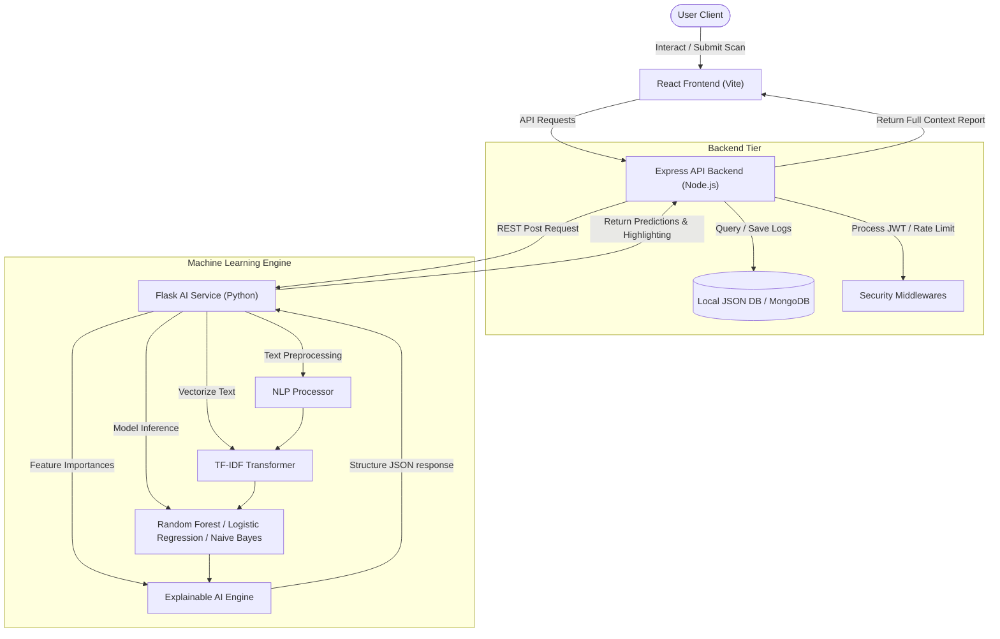

# System Architecture - Veritas AI

Veritas AI utilizes a decoupled, three-tier service layout to guarantee sub-second prediction speeds, high security, and clean separation of concerns.

## Dataflow Pipeline

## Architectural Decoupling

1. **Client Tier (React + Vite)**:
   * A modern, mobile-responsive glassmorphism user interface running in dark mode.
   * Compiles client-side using Vite on port 3000.
   * Integrates state charts via Chart.js for consistent rendering of model predictions.

2. **Core API Gateway (Express.js)**:
   * Operates on port 5000.
   * Manages rate limiting, Helmet header securities, and user authentication tokens (JWT).
   * Orchestrates the fallback database: uses local JSON file-system stores if MongoDB configurations are not provided.
   * Features a local Javascript lexical analyzer fallback: if the Python service fails, the API server executes a regex-based NLP evaluation, returning identical JSON structural payloads to keep the client interactive.

3. **AI Inference Service (Python + Flask)**:
   * Runs on port 8000.
   * Uses a custom rule-based `NLPProcessor` for POS tagging, Named Entity recognition, and sentiment classification.
   * Fits TF-IDF representations onto a Random Forest classifier.
   * Maps active features to explainable text indexes and returns classification statistics.
